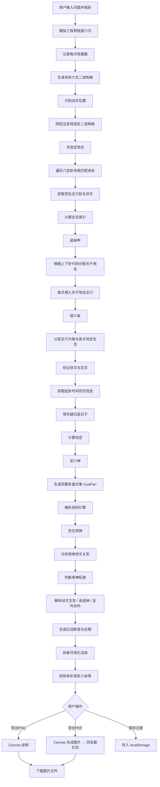

# 六爻排盘解卦 · 项目计划书

> **版本**: v2.2.0 · **最后更新**: 2026-07-15
> 基于京房纳甲六爻理论，覆盖起卦→装卦→解卦→导出完整链路。

---

## 📢 v2.2.0 更新 (2026-07-15)

### 🎯 核心改进
- **分析引擎全面增强**：13 类问题识别 + 25+ 用神关键词 + 6 档旺衰评分
- **解卦结论人性化**：通俗+专业双版本，建议零术语生活化
- **自动连续摇卦**：点击开始后自动摇 6 次，龟壳铜钱动画每爻间隔
- **交互流程优化**：解卦自动保存 + Toast 通知 + 历史查看模式

### 📊 详细更新
请查看 [CHANGELOG.md](./CHANGELOG.md) 了解完整更新内容。

---

## 1. 项目概述

### 1.1 项目定位

一款基于传统**京房纳甲六爻**理论的排盘与解卦工具，支持用户输入问题、模拟摇卦、自动装卦、生成卦盘，并给出白话断语与可视化导出。

### 1.2 项目目标

| 目标 | 说明 |
|:---|:---|
| **准确性** | 严格按京房八宫卦序、纳甲、六亲、六神、旬空规则排盘 |
| **离线可用** | 核心算法不依赖服务端，农历数据内置，目标 PWA |
| **易用性** | 摇卦动画、清晰卦图、白话断语降低门槛；支持手动校正 |
| **可导出** | 原生 Canvas 绘制，轻量导出 PNG / PDF |
| **解卦完整** | 用神、伏神飞神、原忌仇神、动爻生克、进退神、反吟伏吟、神煞与应期 |

### 1.3 技术栈

| 层级 | 选型 |
|:---|:---|
| 前端框架 | Vue 3 / React + Pinia / Zustand |
| 卦图绘制 | 原生 Canvas（`canvasRenderer.js`） |
| 农历计算 | 内置精简数据（参考 `solarlunar` 核心，≤40KB） |
| 导出 | Canvas → PNG（`toDataURL`）+ 浏览器打印 PDF（零依赖） |
| 存储 | `localStorage` |

---

## 2. 功能特性

| 模块 | 功能 |
|:---|:---|
| 摇卦交互 | 模拟三枚铜钱摇六次；随机生成 / 手动录入 / 单爻修正 / 动画反馈 |
| 装卦引擎 | 寻宫定世应 → 纳甲 → 装六亲 → 安六神 → 算旬空 → 伏神飞神 |
| 解卦引擎 | 用神定位、旺衰分析、原忌仇神、动爻生克、进退神、反吟伏吟、神煞、应期、白话断语 |
| 卦盘渲染 | 本卦/变卦、六亲、地支、世应、六神、伏神、神煞可视化 |
| 导出 | 原生 Canvas 绘制并导出 PNG / PDF |
| 历史记录 | `localStorage` 保存/回看卦例 |

---

## 3. 核心流程



---

## 4. 系统架构

### 4.1 模块划分

所有业务逻辑集中在三个独立 JS 模块：

| 模块 | 文件 | 职责 |
|:---|:---|:---|
| 装卦引擎 | `paipan.js` | 纯函数计算，输入摇卦结果与时间，输出完整 `GuaPan`（含伏神飞神） |
| 解卦引擎 | `analyze.js` | 规则驱动，定位用神、旺衰、原忌仇神、进退神、反吟伏吟、神煞、应期、生成断语 |
| 渲染导出 | `canvasRenderer.js` | 卦图 Canvas 绘制、PNG/PDF 导出 |

### 4.2 数据流

```text
用户界面 (UI)
    │
    ├─ 摇卦交互（随机数模拟铜钱 / 手动录入 / 单爻修正）
    │      │
    │      ▼
    │  本卦、变卦、动爻位置
    │      │
    │      ▼
    ├─ 装卦引擎（纯函数计算）
    │      │
    │      ▼
    │  完整卦盘对象（GuaPan）
    │      │
    │      ├─► 卦象渲染组件（Canvas 绘制六爻图）
    │      ├─► 解卦规则引擎（生成白话断语）
    │      └─► 导出服务（PNG/PDF）
    │
    └─ 本地存储（卦例历史）
```

---

## 5. 核心数据与算法

### 5.1 八卦代码

```javascript
const TRIGRAM_BINARY = {
  1: '111', // 乾
  2: '011', // 兑
  3: '101', // 离
  4: '001', // 震
  5: '110', // 巽
  6: '010', // 坎
  7: '100', // 艮
  8: '000'  // 坤
};

const BAGUA_CODE = {
  '111': 1, '011': 2, '101': 3, '001': 4,
  '110': 5, '010': 6, '100': 7, '000': 8
};
```

### 5.2 八宫卦序表

严格按照**京房八宫卦变**顺序。每项为 `[六爻二进制串, 卦名, 世爻索引]`，世爻索引 `0~5`（初爻为上爻）。

```javascript
const BAGONG_GUA_TABLE = [
  { // 乾宫（金）
    gongName: '乾', wuxing: '金',
    list: [
      ['111111','乾为天',5], ['111110','天风姤',0], ['111100','天山遁',1],
      ['111000','天地否',2], ['110000','风地观',3], ['100000','山地剥',4],
      ['101000','火地晋',3], ['101111','火天大有',2]
    ]
  },
  { // 兑宫（金）
    gongName: '兑', wuxing: '金',
    list: [
      ['011011','兑为泽',5], ['011010','泽水困',0], ['011000','泽地萃',1],
      ['011100','泽山咸',2], ['010100','水山蹇',3], ['000100','地山谦',4],
      ['001100','雷山小过',3], ['001011','雷泽归妹',2]
    ]
  },
  { // 离宫（火）
    gongName: '离', wuxing: '火',
    list: [
      ['101101','离为火',5], ['101100','火山旅',0], ['101110','火风鼎',1],
      ['101010','火水未济',2], ['100010','山水蒙',3], ['110010','风水涣',4],
      ['111010','天水讼',3], ['111101','天火同人',2]
    ]
  },
  { // 震宫（木）
    gongName: '震', wuxing: '木',
    list: [
      ['001001','震为雷',5], ['001000','雷地豫',0], ['001010','雷水解',1],
      ['001110','雷风恒',2], ['000110','地风升',3], ['010110','水风井',4],
      ['011110','泽风大过',3], ['011001','泽雷随',2]
    ]
  },
  { // 巽宫（木）
    gongName: '巽', wuxing: '木',
    list: [
      ['110110','巽为风',5], ['110111','风天小畜',0], ['110101','风火家人',1],
      ['110001','风雷益',2], ['111001','天雷无妄',3], ['101001','火雷噬嗑',4],
      ['100001','山雷颐',3], ['100110','山风蛊',2]
    ]
  },
  { // 坎宫（水）
    gongName: '坎', wuxing: '水',
    list: [
      ['010010','坎为水',5], ['010011','水泽节',0], ['010001','水雷屯',1],
      ['010101','水火既济',2], ['011101','泽火革',3], ['001101','雷火丰',4],
      ['000101','地火明夷',3], ['000010','地水师',2]
    ]
  },
  { // 艮宫（土）
    gongName: '艮', wuxing: '土',
    list: [
      ['100100','艮为山',5], ['100101','山火贲',0], ['100111','山天大畜',1],
      ['100011','山泽损',2], ['101011','火泽睽',3], ['111011','天泽履',4],
      ['110011','风泽中孚',3], ['110100','风山渐',2]
    ]
  },
  { // 坤宫（土）
    gongName: '坤', wuxing: '土',
    list: [
      ['000000','坤为地',5], ['000001','地雷复',0], ['000011','地泽临',1],
      ['000111','地天泰',2], ['001111','雷天大壮',3], ['011111','泽天夬',4],
      ['010111','水天需',3], ['010000','水地比',2]
    ]
  }
];
```

**查表函数**：

```javascript
function splitTrigrams(binary6) {
  const upper = binary6.substring(0, 3);
  const lower = binary6.substring(3, 6);
  const findCode = (tri) => Object.entries(TRIGRAM_BINARY).find(([k,v]) => v === tri)?.[0] | 0;
  return { upperCode: findCode(upper), lowerCode: findCode(lower) };
}

function findGongByBinary(binary6) {
  for (let gong of BAGONG_GUA_TABLE) {
    const found = gong.list.find(item => item[0] === binary6);
    if (found) {
      const shi = found[2];
      return {
        gongName: gong.gongName,
        gongWuxing: gong.wuxing,
        guaName: found[1],
        shiYao: shi,
        yingYao: (shi + 3) % 6
      };
    }
  }
  throw new Error('未找到对应卦宫，请检查六爻二进制串');
}
```

### 5.3 纳甲

#### 天干

| 卦 | 内卦干 | 外卦干 |
|:---|:---|:---|
| 乾 | 甲 | 壬 |
| 坤 | 乙 | 癸 |
| 震 / 巽 / 坎 / 离 / 艮 / 兑 | 庚/辛/戊/己/丙/丁（内外同） |

```javascript
const NA_TIAN_GAN = {
  1: { inner: '甲', outer: '壬' },  // 乾
  2: { inner: '丁', outer: '丁' },  // 兑
  3: { inner: '己', outer: '己' },  // 离
  4: { inner: '庚', outer: '庚' },  // 震
  5: { inner: '辛', outer: '辛' },  // 巽
  6: { inner: '戊', outer: '戊' },  // 坎
  7: { inner: '丙', outer: '丙' },  // 艮
  8: { inner: '乙', outer: '癸' }   // 坤
};
```

#### 地支

| 卦 | 内卦（初→三） | 外卦（四→上） |
|:---|:---|:---|
| 乾 | 子、寅、辰 | 午、申、戌 |
| 兑 | 巳、卯、丑 | 亥、酉、未 |
| 离 | 卯、丑、亥 | 酉、未、巳 |
| 震 | 子、寅、辰 | 午、申、戌 |
| 巽 | 丑、亥、酉 | 未、巳、卯 |
| 坎 | 寅、辰、午 | 申、戌、子 |
| 艮 | 辰、午、申 | 戌、子、寅 |
| 坤 | 未、巳、卯 | 丑、亥、酉 |

```javascript
const NA_DI_ZHI = {
  1: { inner: ['子','寅','辰'], outer: ['午','申','戌'] },
  2: { inner: ['巳','卯','丑'], outer: ['亥','酉','未'] },
  3: { inner: ['卯','丑','亥'], outer: ['酉','未','巳'] },
  4: { inner: ['子','寅','辰'], outer: ['午','申','戌'] },
  5: { inner: ['丑','亥','酉'], outer: ['未','巳','卯'] },
  6: { inner: ['寅','辰','午'], outer: ['申','戌','子'] },
  7: { inner: ['辰','午','申'], outer: ['戌','子','寅'] },
  8: { inner: ['未','巳','卯'], outer: ['丑','亥','酉'] }
};
```

### 5.4 六亲

以卦宫五行为"我"，与各爻地支五行比较：

| 关系 | 六亲 |
|:---|:---|
| 同我 | 兄弟 |
| 生我 | 父母 |
| 我生 | 子孙 |
| 克我 | 官鬼 |
| 我克 | 妻财 |

```javascript
const DI_ZHI_WUXING = {
  '子':'水','丑':'土','寅':'木','卯':'木','辰':'土','巳':'火',
  '午':'火','未':'土','申':'金','酉':'金','戌':'土','亥':'水'
};

function getLiuQin(woWuxing, taWuxing) {
  if (woWuxing === taWuxing) return '兄弟';
  const shengMap = { '木':'水','火':'木','土':'火','金':'土','水':'金' };
  const keMap   = { '木':'金','火':'水','土':'木','金':'火','水':'土' };
  if (shengMap[woWuxing] === taWuxing) return '父母';  // 他生我
  if (shengMap[taWuxing] === woWuxing) return '子孙';  // 我生他
  if (keMap[woWuxing] === taWuxing)   return '官鬼';  // 他克我
  if (keMap[taWuxing] === woWuxing)   return '妻财';  // 我克他
}
```

### 5.5 六神

按日干从初爻起排：

```javascript
const LIU_SHEN_LIST = ['青龙','朱雀','勾陈','螣蛇','白虎','玄武'];

function getLiuShenOrder(riGan) {
  const startMap = {
    '甲':'青龙','乙':'青龙', '丙':'朱雀','丁':'朱雀',
    '戊':'勾陈','己':'勾陈', '庚':'螣蛇','辛':'螣蛇',
    '壬':'白虎','癸':'白虎'
  };
  const startIdx = LIU_SHEN_LIST.indexOf(startMap[riGan]);
  return yaoIndex => LIU_SHEN_LIST[(startIdx + yaoIndex) % 6];
}
```

### 5.6 旬空

```javascript
const JIAZI = (() => {
  const gan = ['甲','乙','丙','丁','戊','己','庚','辛','壬','癸'];
  const zhi = ['子','丑','寅','卯','辰','巳','午','未','申','酉','戌','亥'];
  const arr = [];
  for (let i = 0; i < 60; i++) arr.push(gan[i % 10] + zhi[i % 12]);
  return arr;
})();

function getXunKong(riGanZhi) {
  const idx = JIAZI.indexOf(riGanZhi);
  const kongPairs = [
    ['戌','亥'], ['申','酉'], ['午','未'],
    ['辰','巳'], ['寅','卯'], ['子','丑']
  ];
  return kongPairs[Math.floor(idx / 10)];
}
```

### 5.7 装纳甲辅助函数

```javascript
function installNaJia(yaoArray, upperCode, lowerCode) {
  const upperGan = NA_TIAN_GAN[upperCode].outer;
  const lowerGan = NA_TIAN_GAN[lowerCode].inner;
  const upperZhi = NA_DI_ZHI[upperCode].outer;
  const lowerZhi = NA_DI_ZHI[lowerCode].inner;
  for (let i = 0; i < 6; i++) {
    const gan = i < 3 ? lowerGan : upperGan;
    const zhi = i < 3 ? lowerZhi[i] : upperZhi[i - 3];
    yaoArray[i].naJia = { tianGan: gan, diZhi: zhi, wuXing: DI_ZHI_WUXING[zhi] };
  }
}

function installLiuQin(yaoArray, gongWuxing) {
  yaoArray.forEach(yao => { yao.naJia.liuQin = getLiuQin(gongWuxing, yao.naJia.wuXing); });
}
```

---

## 6. 模块详细设计

### 6.1 摇卦交互

每次摇卦生成 0~3 个背面：

| 背面数 | 阴阳 | 动爻 | 变爻 |
|:---|:---|:---|:---|
| 0 | `--` 老阴 | 是 | `—` |
| 1 | `—` 少阳 | 否 | - |
| 2 | `--` 少阴 | 否 | - |
| 3 | `—` 老阳 | 是 | `--` |

```javascript
function shakeOnce() {
  const coins = [Math.random(), Math.random(), Math.random()]
    .map(v => v < 0.5 ? '字' : '背');
  return coins.filter(c => c === '背').length;
}

function buildYao(backCount) {
  if (backCount === 0) return { yinYang: '--', isChanged: true, changedYinYang: '—' };
  if (backCount === 1) return { yinYang: '—', isChanged: false };
  if (backCount === 2) return { yinYang: '--', isChanged: false };
  if (backCount === 3) return { yinYang: '—', isChanged: true, changedYinYang: '--' };
}
```

**交互增强**：
- **动画**：逐爻播放 2 秒铜钱旋转/翻滚动画，随机生成背面数
- **手动校正**：六次摇完后可点击任意爻修改背面数（0~3），自动更新阴阳及本变卦
- **手动排卦**：增设入口，允许直接输入六个背面数或选择"老阴/少阳/少阴/老阳"

```javascript
const yaoResults = [d1, d2, d3, d4, d5, d6]; // 初爻到上爻
function setManualBeiShu(index, count) {
  yaoResults[index] = count; // 触发重新排盘
}
```

### 6.2 装卦引擎 (`paipan.js`)

**输入**：六次摇卦背面数数组、问题、起卦时间。

#### 完整装卦流程

```javascript
function buildGuaPan(lineResults, question, date) {
  // 1. 生成本卦、变卦二进制串
  let benBinary = '', bianBinary = '';
  const dongIndexes = [];
  for (let i = 5; i >= 0; i--) {
    const backs = lineResults[i];
    let yinYang, isDong, changed;
    if (backs === 0)      { yinYang = '0'; isDong = true;  changed = '1'; }
    else if (backs === 1) { yinYang = '1'; isDong = false; changed = '1'; }
    else if (backs === 2) { yinYang = '0'; isDong = false; changed = '0'; }
    else                  { yinYang = '1'; isDong = true;  changed = '0'; }
    benBinary += yinYang;
    bianBinary += (isDong ? changed : yinYang);
    if (isDong) dongIndexes.unshift(5 - i);
  }

  // 2. 寻宫定世应
  const gongInfo = findGongByBinary(benBinary);
  const { upperCode, lowerCode } = splitTrigrams(benBinary);

  // 3. 构建初始爻列表
  const yaoList = lineResults.map((backs, idx) => {
    const yao = {
      index: idx,
      yinYang: benBinary[5 - idx] === '1' ? '—' : '--',
      isChanged: dongIndexes.includes(idx),
      naJia: null
    };
    if (yao.isChanged) yao.changedYinYang = bianBinary[5 - idx] === '1' ? '—' : '--';
    return yao;
  });

  // 4. 装纳甲 + 六亲
  installNaJia(yaoList, upperCode, lowerCode);
  installLiuQin(yaoList, gongInfo.gongWuxing);

  // 5. 标记世应
  yaoList[gongInfo.shiYao].shiYing = '世';
  yaoList[gongInfo.yingYao].shiYing = '应';

  // 6. 时间信息 + 旬空 + 六神
  const { yueJian, riChen, riGan, riGanZhi } = getTimeInfo(date);
  const xunKong = getXunKong(riGanZhi);
  const assignLiuShen = getLiuShenOrder(riGan);
  yaoList.forEach(yao => { yao.naJia.liuShen = assignLiuShen(yao.index); });

  // 7. 输出卦盘
  return {
    question, startTime: date,
    lunarMonth: yueJian, lunarDay: riChen, xunKong,
    benGuaName: gongInfo.guaName,
    bianGuaName: findGongByBinary(bianBinary).guaName,
    gongName: gongInfo.gongName, gongWuxing: gongInfo.gongWuxing,
    dongYaoIndexes: dongIndexes,
    shiYaoIndex: gongInfo.shiYao, yingYaoIndex: gongInfo.yingYao,
    yaoList, yongShen: null
  };
}
```

#### 伏神飞神机制

**触发条件**：本卦与变卦所有爻的六亲中均未出现用神时启用。

**伏神来源**：本卦所属宫位的首卦（八纯卦）。在首卦中定位用神所在爻位，将其"伏藏"到本卦同位爻下方。

- **伏神**：首卦同位爻的六亲及纳支
- **飞神**：本卦该爻位原有的六亲及纳支

```javascript
function resolveFuShen(guaPan, yongShen) {
  const allYao = [...guaPan.yaoList, ...(guaPan.bianYaoList || [])];
  if (allYao.some(y => y.naJia?.liuQin === yongShen)) return;

  const pureGua = getPureGuaByGong(guaPan.gongName);
  const candidates = pureGua.reduce((acc, yao, i) => {
    if (yao.liuQin === yongShen) acc.push(i);
    return acc;
  }, []);
  if (!candidates.length) return;

  const chosenIdx = pickBestFuIndex(candidates, guaPan.dongYaoIndexes, guaPan.shiYaoIndex);
  const fu = pureGua[chosenIdx];
  const fei = guaPan.yaoList[chosenIdx];

  guaPan.fuShen = {
    yaoIndex: chosenIdx,
    fuLiuQin: fu.liuQin, fuDiZhi: fu.diZhi, fuWuXing: fu.wuXing,
    feiLiuQin: fei.naJia.liuQin, feiDiZhi: fei.naJia.diZhi,
    relation: calcFuFeiRelation(fu.wuXing, fei.naJia.wuXing)
  };
}

function pickBestFuIndex(candidates, dongYaoIndexes, shiYaoIndex) {
  // 优先级：动爻同位 > 离世爻最近 > 初爻优先
  const dongMatch = candidates.find(i => dongYaoIndexes.includes(i));
  if (dongMatch !== undefined) return dongMatch;
  candidates.sort((a, b) => Math.abs(a - shiYaoIndex) - Math.abs(b - shiYaoIndex));
  return candidates[0];
}

function calcFuFeiRelation(fuWuXing, feiWuXing) {
  if (fuWuXing === feiWuXing) return '比和';
  if (xiangSheng(fuWuXing, feiWuXing)) return '伏生飞（泄气）';
  if (xiangSheng(feiWuXing, fuWuXing)) return '飞生伏（长生）';
  if (xiangKe(fuWuXing, feiWuXing)) return '伏克飞（出暴）';
  if (xiangKe(feiWuXing, fuWuXing)) return '飞克伏（伤身）';
}
```

**出伏条件**：飞神逢冲、旬空、月破，或伏神临日辰、月建、得动爻生扶。

### 6.3 解卦引擎 (`analyze.js`)

#### 用神定位（13 类问题，25+ 关键词/六亲）

| 问题类型 | 触发词 | 对应用神 |
|:---|:---|:---|
| 财运 | 财、钱、投资、生意、股票、基金、涨薪、借… | 妻财 |
| 事业 | 工作、升职、跳槽、面试、offer、领导、老板… | 官鬼 |
| 感情 | 感情、婚姻、恋爱、相亲、分手、复合、桃花… | — |
| 健康 | 身体、疾病、手术、康复、不适… | 世爻/相关六亲 |
| 学业 | 考试、成绩、论文、毕业、录取、考研… | 父母 |
| 出行 | 旅游、出差、远行、度假… | 子孙/世爻 |
| 寻物 | 找、丢、遗失、不见了、失踪… | — |
| 迁移 | 搬家、换城市、移民、搬迁… | — |
| 选择 | 要不要、该不该、选哪个… | — |
| 人际 | 矛盾、吵架、冲突、冷战、人缘… | 兄弟 |
| 子嗣 | 怀孕、备孕、胎儿、宝宝… | 子孙 |
| 官司 | 官司、诉讼、仲裁、纠纷… | 官鬼 |
| 综合 | 其他未匹配 | 世爻六亲（自动） |

#### 分析维度

1. **用神出现与否**：遍历本卦/变卦；不现时读取伏神
2. **用神与世爻关系**：生世/克世/世生用/世克用/比和
3. **用神旺衰（6 档评分）**：月建±2、日辰±1、空亡-2、月破-3、日破-1
4. **原神・忌神・仇神**
5. **动爻深度分析**：与用神关系、回头克、化墓/化绝、进退神、反吟伏吟
6. **全盘格局**：六合、六冲、三合局、全局伏吟/反吟、游魂、归魂
7. **神煞**：天乙贵人、桃花、驿马
8. **应期推算**：旺衰待时、合待冲、墓待冲、空待实、伏待飞冲

```javascript
// 地支顺序表
const DI_ZHI = ['子','丑','寅','卯','辰','巳','午','未','申','酉','戌','亥'];

function detectJinTui(dongYao, bianYao) {
  if (!dongYao.isChanged || dongYao.yinYang !== bianYao.yinYang) return null;
  const dongWuXing = DI_ZHI_WUXING[dongYao.naJia.diZhi];
  const bianWuXing = DI_ZHI_WUXING[bianYao.naJia.diZhi];
  if (dongWuXing !== bianWuXing) return null;
  const dongIdx = DI_ZHI.indexOf(dongYao.naJia.diZhi);
  const bianIdx = DI_ZHI.indexOf(bianYao.naJia.diZhi);
  if (bianIdx - dongIdx === 1 || bianIdx - dongIdx === -11) return '进神';
  if (dongIdx - bianIdx === 1 || dongIdx - bianIdx === -11) return '退神';
  return null;
}
```

7. **反吟・伏吟**：
   - 爻反吟：动爻与变爻地支相冲（六冲对：子午、丑未、寅申、卯酉、辰戌、巳亥）
   - 爻伏吟：动爻与变爻地支相同

8. **神煞**（按日干/日支查地支标注到各爻）：

| 神煞 | 查法 | 说明 |
|:---|:---|:---|
| 天乙贵人 | 日干 | 甲戊庚牛羊，乙己鼠猴乡，丙丁猪鸡位，壬癸兔蛇藏，六辛逢虎马 |
| 桃花 | 日支 | 申子辰在酉，寅午戌在卯，亥卯未在子，巳酉丑在午 |
| 驿马 | 日支 | 申子辰在寅，寅午戌在申，亥卯未在巳，巳酉丑在亥 |
| 劫煞 | 日支 | 申子辰在巳，寅午戌在亥，亥卯未在申，巳酉丑在寅 |
| 将星 | 日支 | 申子辰在子，寅午戌在午，亥卯未在卯，巳酉丑在酉 |

9. **应期推算**：

| 条件 | 应期 |
|:---|:---|
| 用神休囚 | 待当令之月、日 |
| 用神被合 | 待冲开合之日 |
| 用神入墓 | 待冲出墓库之日 |
| 用神旬空 | 出空填实之日 |
| 伏神 | 飞神被冲之日 |

#### 白话断语生成

```text
用神妻财子水，现于本卦三爻，旺相得月建申金所生。
世爻辰土持世，妻财克世，求财有得但较为辛苦。
二爻兄弟寅木动化回头克，破财之象减轻。
伏神官鬼午火藏于四爻父母未土之下，飞生伏，事业有暗中助力。
整体财运可图，但需防合作纠纷，农历七月、十月易有转机。
```

### 6.4 渲染与导出 (`canvasRenderer.js`)

采用原生 Canvas 绘制，`drawGuaPan(ctx, guaPan, options)`：

- 每行显示：六亲、世应、阴阳爻、地支、六神、神煞、伏神
- 动爻红色标记，变卦小字侧写
- 顶部：本卦名、变卦名、月建、日辰、空亡、原忌仇神、格局、应期

```javascript
// 导出 PNG
function exportPNG(guaPan) {
  const canvas = document.createElement('canvas');
  canvas.width = 400; canvas.height = 600;
  const ctx = canvas.getContext('2d');
  drawGuaPan(ctx, guaPan, { scale: 2 });
  const link = document.createElement('a');
  link.download = `${guaPan.question}_卦盘.png`;
  link.href = canvas.toDataURL('image/png');
  link.click();
}

// 导出 PDF（零依赖：Canvas → 图片 → 浏览器打印）
function exportPDF(guaPan) {
  const canvas = document.createElement('canvas');
  canvas.width = 400; canvas.height = 600;
  const ctx = canvas.getContext('2d');
  drawGuaPan(ctx, guaPan, { scale: 2 });
  const img = document.createElement('img');
  img.src = canvas.toDataURL('image/png');
  // 插入隐藏 img 后调用 window.print()，浏览器"另存为 PDF"
}
```

> 原 `html2canvas`(~100KB) + `jsPDF`(~200KB) 方案已废弃，新方案体积约 5KB。

### 6.5 农历计算

采用内置精简数据（参考 `solarlunar` 核心），满足 PWA 离线需求。

```javascript
// 方案一：使用 solarlunar（推荐）
import { solar2lunar } from 'solarlunar';

function getTimeInfo(date = new Date()) {
  const d = solar2lunar(date.getFullYear(), date.getMonth() + 1, date.getDate());
  return {
    yueJian: d.monthZhi,           // 月地支 → 月建
    riChen: d.dayZhi,              // 日地支 → 日辰
    riGan: d.dayGan,               // 日天干 → 六神
    riGanZhi: d.dayGan + d.dayZhi  // 日干支 → 旬空
  };
}
```

```javascript
// 方案二：完全自研（日干支公式法，零依赖）
const TIAN_GAN = ['甲','乙','丙','丁','戊','己','庚','辛','壬','癸'];
const DI_ZHI = ['子','丑','寅','卯','辰','巳','午','未','申','酉','戌','亥'];

function getRiGanZhi(date) {
  const baseDate = new Date(1900, 0, 1); // 甲戌日
  const diffDays = Math.floor((date - baseDate) / 86400000);
  const ganIndex = (diffDays % 10 + 10) % 10;
  const zhiIndex = (diffDays % 12 + 12) % 12;
  return { gan: TIAN_GAN[ganIndex], zhi: DI_ZHI[zhiIndex] };
}
```

> `solarlunar` 的 `lunarInfo` 数组仅 201 个数字（1900–2100 年），minify 后 ≤20KB，可直接复制到 `utils/lunar.js` 实现完全内置。

### 6.6 本地存储

```javascript
function saveRecord(guaPan) {
  const records = JSON.parse(localStorage.getItem('gua_records') || '[]');
  records.push({ id: Date.now(), createdAt: new Date().toISOString(), guaPan });
  localStorage.setItem('gua_records', JSON.stringify(records));
}
```

---

## 7. 格局体系

### 7.1 全盘格局（`patterns: string[]`）

| 格局 | 检测方式 | 含义 |
|:---|:---|:---|
| 六合 | 世应地支六合 | 和合顺利 |
| 六冲 | 世应地支六冲 | 冲动反复 |
| 三合局 | 动爻地支形成申子辰/亥卯未/寅午戌/巳酉丑 | 聚气强力 |
| 伏吟 | 全体动爻地支不变 | 呻吟停滞 |
| 反吟 | 全体动爻地支逢冲 | 反复无常 |
| 游魂 | 卦在宫中第 7 位 | 人心不定 |
| 归魂 | 卦在宫中第 8 位 | 事有归宿 |

### 7.2 单爻效应

- **进神/退神**：动爻化同五行地支顺进/逆退（子→丑进、午→巳退）
- **反吟/伏吟**：动爻与变爻地支相冲/相同
- **回头克**：变爻五行克动爻五行
- **化墓/化绝**：变爻地支为动爻五行之墓/绝（金墓丑绝寅等）

### 7.3 应期推理引擎

根据用神状态输出参考日期：

- 用神休囚 → 待当令之月、日
- 用神被合 → 待冲开合之日
- 用神入墓 → 待冲出墓库之日
- 用神旬空 → 出空填实之日
- 伏神 → 飞神被冲之日

---

## 8. 数据结构参考

### 8.1 爻 (Yao)

```typescript
interface Yao {
  index: number;                  // 0~5，初爻到上爻
  yinYang: '—' | '--';          // 本卦阴阳
  isChanged: boolean;             // 是否为动爻
  changedYinYang?: '—' | '--';  // 变卦阴阳
  changedDiZhi?: string;          // 变爻地支（用于化墓绝检测）
  naJia: {
    tianGan: string;
    diZhi: string;
    wuXing: string;
    liuQin: string;
    liuShen: string;
    shiYing: '世' | '应' | '';
  } | null;
  shenSha?: string[];             // 神煞列表
}
```

### 8.2 卦盘 (GuaPan)

```typescript
interface GuaPan {
  question: string;
  startTime: Date;
  lunarMonth: string;             // 月建
  lunarDay: string;               // 日辰
  xunKong: [string, string];

  benGuaName: string;
  bianGuaName: string;
  dongYaoIndexes: number[];
  yaoList: Yao[];

  yongShen: string | null;
  shiYaoIndex: number;
  yingYaoIndex: number;

  gongName: string;
  gongWuxing: string;
  guaType: '' | '游魂' | '归魂';  // 卦在宫中的类型

  fuShen?: {
    yaoIndex: number;
    fuLiuQin: string; fuDiZhi: string; fuWuXing: string;
    feiLiuQin: string; feiDiZhi: string;
    relation: string;
  };
}
```

### 8.3 解卦分析 (Analysis)

```typescript
interface Analysis {
  yongShen: string;
  yongShenYao: Yao | null;
  isFuShen: boolean;
  questionType: string;           // 13 类问题类型
  autoDetected?: boolean;         // 是否自动检测用神
  relationToShi: string;
  strength: '旺' | '衰' | '平';
  yuanShen: string;
  jiShen: string;
  chouShen: string;
  dongYaoDetails: Array<{         // 每个动爻的详细信息
    index: number;
    pos: string;
    liuQin: string;
    diZhi: string;
    effect: string;               // 效应描述
    jinTui: string | null;
    fanFu: string | null;
    huiTouKe: boolean;
    huaJueMu: string;             // '绝' | '墓' | ''
    relationToYong: string;       // 与用神关系
  }>;
  dongYaoEffects: string[];       // 动爻效应字符串列表
  patterns: string[];             // 格局列表（六合/六冲/三合局等）
  shenShaEffects: string[];       // 神煞列表
  yingQiCandidates: string[];     // 应期候选
  conclusion: string;             // 完整断语
}
```

---

## 9. 缺陷记录与改进历史

### 9.1 v2.2.0 新增改进 (2026-07-15)

| # | 改进 | 位置 |
|:---|:---|:---|
| 1 | 分析引擎全面增强：13 类问题 + 25 用神关键词 + 6 档旺衰评分 | `analyze.js` |
| 2 | 格局体系扩展：三合局、游魂/归魂、回头克、化墓/化绝 | `analyze.js` + `paipan.js` |
| 3 | 结论人性化：通俗+专业双版本，零术语建议，应期自然时间翻译 | `analyze.js` |
| 4 | 自动连续摇卦 + 解卦自动保存 + Toast 通知系统 | `ShakePage.vue` + `ResultPage.vue` + `toastStore.js` |
| 5 | 历史查看模式（`isViewing`）区分新结果与历史查看 | `guaStore.js` |
| 6 | 爻线等宽 CSS 渲染 + Canvas 动爻 ×/○ 标记 | `ShakePage.vue` + `canvasRenderer.js` |
| 7 | ClickSpark `h-full` 导致 canvas 64591px 异常修复 | `ClickSpark.vue` |

### 9.2 v2.1.0 已修复缺陷 (2026-07-14)

| # | 缺陷 | 状态 |
|:---|:---|:---|
| 1 | 用神定位"未取"问题 | ✅ 已修复（改进默认判断） |
| 2 | 解卦结论过于技术性，普通人看不懂 | ✅ 已修复（重写结论生成） |
| 3 | 摇卦动画单调，无铜钱正反面区分 | ✅ 已修复（龟壳+铜钱翻转） |
| 4 | 卦图六神和神煞列显示不全 | ✅ 已修复（调整列宽） |
| 5 | 用户输入缺少 XSS 防护 | ✅ 已修复（输入清理） |
| 6 | localStorage 明文存储无错误处理 | ✅ 已修复（安全防护） |
| 7 | PWA 配置不完整 | ✅ 已修复（完整配置） |
| 8 | 缺少环境变量和 Git 配置 | ✅ 已修复（添加模板） |
| 9 | 构建无代码分割优化 | ✅ 已修复（vendor chunks） |
| 10 | Canvas 重复创建性能浪费 | ✅ 已修复（缓存机制） |
| 11 | 导出无成功/失败提示 | ✅ 已修复（添加提示） |
| 12 | 重新摇卦无确认对话框 | ✅ 已修复（添加确认） |

### 9.2 v2.0.0 已识别缺陷

| # | 缺陷 | 状态 |
|:---|:---|:---|
| 1 | 伏神飞神机制 → 用神不现时解卦体系不完整 | ✅ 已设计（见 §6.2） |
| 2 | 纯随机摇卦缺乏手动校正与动画反馈 | ✅ 已设计（见 §6.1） |
| 3 | `lunar-javascript` 外部依赖与 PWA 离线冲突 | ✅ 已替换为 `solarlunar`（见 §6.5） |
| 4 | 解卦引擎缺少进退神、反吟伏吟、神煞、应期 | ✅ 已设计（见 §6.3） |
| 5 | `html2canvas`+`jsPDF` 体积过重（~300KB） | ✅ 已替换为原生 Canvas（见 §6.4） |

### 9.3 改进落实位置

#### v2.1.0 改进项

| 改进项 | 章节/文件 |
|:---|:---|
| 用神定位优化 | `src/engine/analyze.js` |
| 结论生成重构 | `src/engine/analyze.js` |
| 龟壳摇卦动画 | `src/views/ShakePage.vue` |
| 铜钱正反面显示 | `src/views/ShakePage.vue` |
| 卦图列宽调整 | `src/renderer/canvasRenderer.js` |
| XSS 防护 | `src/stores/guaStore.js` |
| localStorage 安全 | `src/utils/storage.js` |
| PWA 配置 | `vite.config.js` |
| 构建优化 | `vite.config.js` |

#### v2.0.0 改进项

| 改进项 | 章节 |
|:---|:---|
| 伏神飞神算法实现 | §6.2 装卦引擎 |
| 摇卦手动校正 + 动画 | §6.1 摇卦交互 |
| 内置农历数据方案 | §6.5 农历计算 |
| 进退神 / 反吟伏吟 / 神煞 / 应期 | §6.3 解卦引擎 |
| 原生 Canvas 导出 | §6.4 渲染与导出 |

---

## 10. 使用说明

1. 打开应用，输入所占问题。
2. 点击"开始摇卦"，系统自动连续摇 6 次（龟壳摇晃 + 铜钱翻转动画，每爻间隔约 2 秒），也可展开"手动排卦模式"直接选择背面数。
3. 完成后自动展示六爻结果，可逐爻校正背面数。点击"开始解卦"。
4. 系统排盘并解卦，展示 Canvas 卦图 + 分析卡片：用神定位、原忌仇神、动爻变化、格局、神煞、应期、白话建议。解卦完成自动保存。
5. 可导出 PNG/PDF，或通过底部 Tab 切换查看历史记录。

---

## 11. 注意事项与免责声明

- **农历计算**：使用内置经验证的精简农历数据；空亡、月建错误将导致解卦偏差
- **离线可用**：核心算法与农历数据均不依赖网络，适合 PWA 部署
- **导出体积**：原生 Canvas 方案，导出模块约 5KB
- **移动端适配**：摇卦按钮需适配触摸操作，动画性能需在中低端设备上验证
- **组件树**：推荐 Vue 3 + Pinia 或 React + Zustand 管理全局卦盘状态，核心页面为摇卦页 → 卦盘展示页 → 历史记录页
- **免责声明**：本工具结果仅供传统文化研究与娱乐参考，不构成任何形式的决策建议；导出图片底部应注明"结果仅供娱乐参考"
